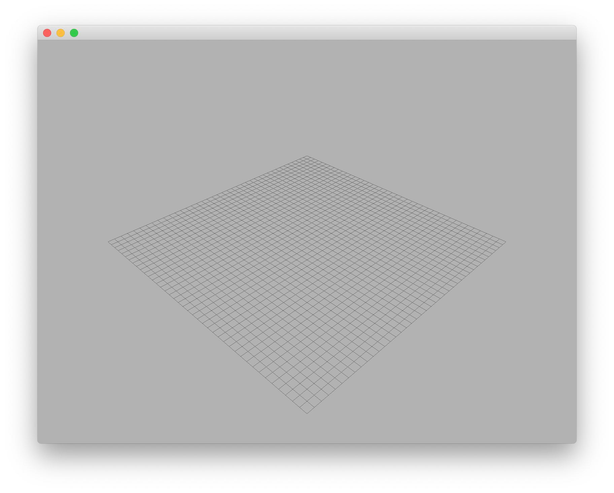

# 高级用户文档二：创建窗口

Ash Engine 对 Qt 和 OpenGL 进行了高层封装，没有 OpenGL 基础的用户也能轻松创建并渲染自己的场景。

## 介绍

要创建一个窗口，你需要创建三个和 OpenGL 渲染相关的类：

* `OpenGLWindow`：用于渲染的窗口（类比**画板**）
* `OpenGLRenderer`：OpenGL渲染器（类比**画笔**）
* `OpenGLScene`：被渲染的场景

每个 `OpenGLScene` 实例和 `Scene` 实例一对一关联。`Scene` 维护了整个场景的树状结构，`OpenGLScene` 则负责 OpenGL 资源的管理。在多数情况下，用户只需通过 `Scene` 来操作整个场景，无需关心 `OpenGLScene` 内部的工作机制。

## 示例

下面的代码展示了如何创建一个窗口来进行渲染。

```cpp
int main(int argc, char *argv[]) {
    initApplication();

    QApplication a(argc, argv);

    // Step 1: Create an OpenGLWindow
    OpenGLWindow* window = new OpenGLWindow;
    window->resize(800, 600);

    // Step 2: Create an OpenGLRenderer for the window
    OpenGLRenderer* renderer = new OpenGLRenderer;
    window->setRenderer(renderer);

    // Step 3: Create a scene
    Scene* scene = new Scene;
    window->setScene(new OpenGLScene(scene));

    // Step 4: Customize your scene
    scene->addGridline(new Gridline);

    window->show();

    return a.exec();
}
```

将 `src/AshEngine.cpp` 中的 `main` 函数的内容替换为以上代码，重新编译执行，你可以得到以下结果：


