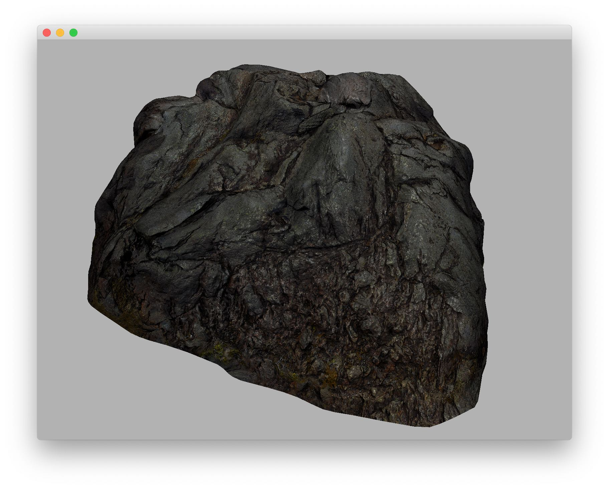

# 高级用户文档三：加载模型

## 加载内置模型

Ash Engine 内置了五种基本模型：

1. 立方体
2. 球体
3. 圆锥体
4. 圆柱体
5. 平面

### 示例

下面的代码展示了如何创建几个基本体，加入场景，并渲染它们：

```cpp
int main(int argc, char *argv[]) {
    initApplication();

    QApplication a(argc, argv);

    // Step 1: Create an OpenGLWindow
    OpenGLWindow* window = new OpenGLWindow;
    window->resize(800, 600);

    // Step 2: Create an OpenGLRenderer for the window
    OpenGLRenderer* renderer = new OpenGLRenderer;
    window->setRenderer(renderer);

    // Step 3: Create a scene
    Scene* scene = new Scene;
    window->setScene(new OpenGLScene(scene));

    // Step 4: Customize your scene
    scene->addGridline(new Gridline);

    Model* cubeModel = ModelLoader::loadCubeModel();
    cubeModel->setPosition(QVector3D(0, 10, 0));
    cubeModel->setScaling(QVector3D(10, 10, 10));
    cubeModel->childMeshes()[0]->material()->setColor(QVector3D(0.0f, 0.8f, 1.0f));
    scene->addModel(cubeModel);

    Model* planeModel = ModelLoader::loadPlaneModel();
    planeModel->setPosition(QVector3D(0, 5, 0));
    planeModel->setScaling(QVector3D(50, 50, 50));
    scene->addModel(planeModel);

    DirectionalLight* light = new DirectionalLight(QVector3D(1, 1, 1), QVector3D(-2, -4, -3));
    scene->addLight(light);

    window->show();

    return a.exec();
}
```

将 `src/AshEngine.cpp` 中的 `main` 函数的内容替换为以上代码，重新编译执行，你可以得到以下的结果：


## 从文件加载模型

你也可以用文件中加载自己的模型。常见的格式（`*.obj`, `*.fbx`, `*.3ds` 等）均受支持。完整的支持列表请参考 [assimp 的 GitHub 主页](https://github.com/assimp/assimp)。

### 示例

下面的代码展示了如何从文件中加载模型：

```cpp
int main(int argc, char *argv[]) {
    initApplication();

    QApplication a(argc, argv);

    // Step 1: Create an OpenGLWindow
    OpenGLWindow* window = new OpenGLWindow;
    window->resize(800, 600);
    window->setEnableMousePicking(false); // Disable mouse picking to improve performance

    // Step 2: Create an OpenGLRenderer for the window
    OpenGLRenderer* renderer = new OpenGLRenderer;
    window->setRenderer(renderer);

    // Step 3: Create a scene
    Scene* scene = new Scene;
    window->setScene(new OpenGLScene(scene));

    // Step 4: Customize your scene
    ModelLoader loader;
    Model* model = loader.loadModelFromFile("/path-to-your-model/model.obj");
    scene->addModel(model);

    DirectionalLight* directionalLight = new DirectionalLight(QVector3D(1, 1, 1), QVector3D(-2, -4, -3));
    scene->addLight(directionalLight);

    window->show();

    return a.exec();
}
```

将 `src/AshEngine.cpp` 中的 `main` 函数的内容替换为以上代码，将 `/path-to-your-model/model.obj` 替换为你自己的模型文件地址，重新编译执行，你可以得到类似以下的结果：

