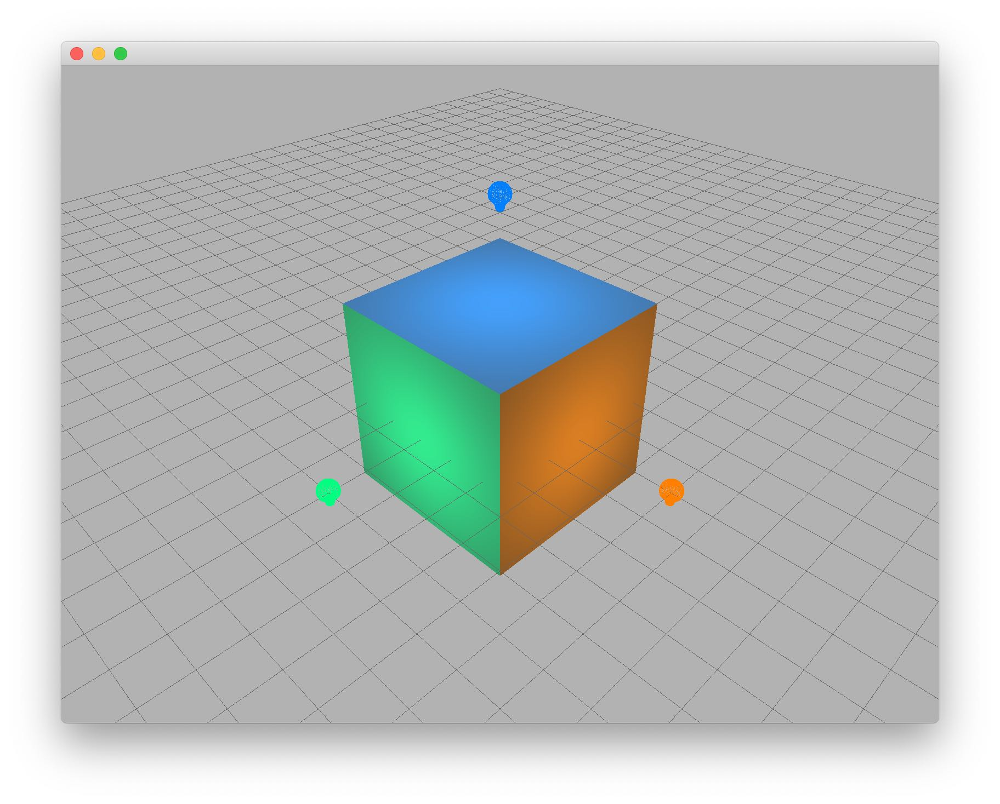

# Advanced User Manual 4: Multiple Lights

In previous manuals, we only added a directional light to the scene (otherwise all models will be dark). Now we will add more lights to the scene.

## Types

Ash Engine supports four types of light sources, and up to eight for each type of light source:

| Type | Class Name| Attribute |
|------|-----------|-----------|
| Ambient Light     | `AmbientLight`     | Color, Intensity |
| Directional Light | `DirectionalLight` | Color, Intensity, Direction |
| Point Light       | `PointLight`       | Color, Intensity, Position, Attenuation|
| Spot Light        | `SpotLight`        | Color, Intensity, Position, Direction, Cut-offs, Attenuation|

## Example

The following code shows how to add multiple lights to the scene and set their color and intensity:

```cpp
int main(int argc, char *argv[]) {
    initApplication();

    QApplication a(argc, argv);

    // Step 1: Create an OpenGLWindow
    OpenGLWindow* window = new OpenGLWindow;
    window->resize(800, 600);

    // Step 2: Create an OpenGLRenderer for the window
    OpenGLRenderer* renderer = new OpenGLRenderer;
    window->setRenderer(renderer);

    // Step 3: Create a scene
    Scene* scene = new Scene;
    window->setScene(new OpenGLScene(scene));

    // Step 4: Customize your scene
    scene->addGridline(new Gridline);
    scene->camera()->moveForward(500.0f);

    Model* cubeModel = ModelLoader::loadCubeModel();
    cubeModel->setScaling(QVector3D(5, 5, 5));
    scene->addModel(cubeModel);

    DirectionalLight* directionalLight = new DirectionalLight(QVector3D(1, 1, 1), QVector3D(-2, -4, -3));
    directionalLight->setIntensity(0.6f);
    scene->addLight(directionalLight);

    PointLight* pointLight1 = new PointLight(QVector3D(1, 0.5, 0), QVector3D(5, 0, 0));
    pointLight1->setIntensity(1.2f);
    scene->addLight(pointLight1);

    PointLight* pointLight2 = new PointLight(QVector3D(0, 0.5, 1), QVector3D(0, 5, 0));
    pointLight2->setIntensity(1.2f);
    scene->addLight(pointLight2);

    PointLight* pointLight3 = new PointLight(QVector3D(0, 1, 0.5), QVector3D(0, 0, 5));
    pointLight3->setIntensity(1.2f);
    scene->addLight(pointLight3);

    window->show();

    return a.exec();
}
```

Replace the `main` function in `src/AshEngine.cpp` with the above code, recompile and execute, you can get the following results:


