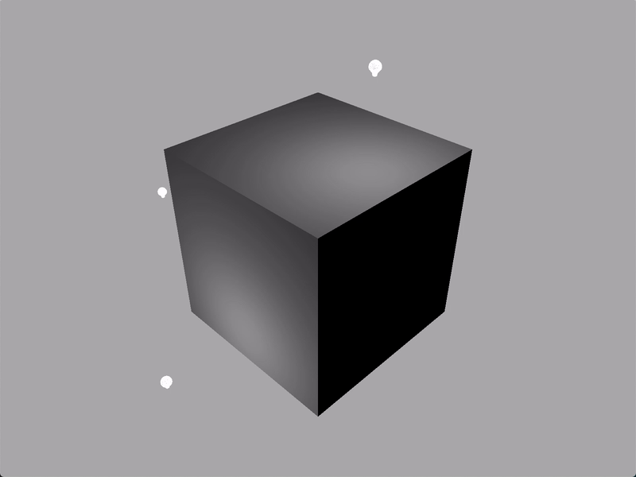

# Advanced User Manual 6: Custom Rendering Loop

## Rendering loop

The renderer can only render one frame at a time, and a rendering loop is required to form a coherent animation. By default, the rendering loop only handles user input (key and mouse operations), allowing the user to move freely in the scene.

If you want to implement a dynamic scene (the objects in the scene are changing every frame), you need to add a custom rendering loop based on the default.

## Example

The following code shows how to write a custom rendering loop function that implements three dynamic lights.

`customRenderingLoop(Scene* scene)` is a custom rendering loop function that is called before the rendering of **each** frame. The input parameter `Scene* scene` is the `scene` we created in `main`.

> For users who are interested in the implementation, please refer to [Function Pointers in C and C++] (https://www.cprogramming.com/tutorial/function-pointers.html)

```cpp
void customRenderingLoop(Scene* scene) {
    PointLight* light0 = scene->pointLights()[0];
    PointLight* light1 = scene->pointLights()[1];
    PointLight* light2 = scene->pointLights()[2];

    static int angle0 = 0, angle1 = 90, angle2 = 180;
    angle0++; angle1++; angle2++;

    light0->setPosition(QVector3D(10 * sin(rad(angle0)), 0, 10 * cos(rad(angle0))));
    light1->setPosition(QVector3D(10 * sin(rad(angle1)), 10 * cos(rad(angle1)), 0));
    light2->setPosition(QVector3D(0, 10 * cos(rad(angle2)), 10 * sin(rad(angle2))));
}

int main(int argc, char *argv[]) {
    initApplication();

    QApplication a(argc, argv);

    // Step 1: Create an OpenGLWindow
    OpenGLWindow* window = new OpenGLWindow;
    window->resize(800, 600);
    window->setEnableMousePicking(false); // Disable mouse picking to improve performance

    // Step 2: Create an OpenGLRenderer for the window
    OpenGLRenderer* renderer = new OpenGLRenderer;
    window->setRenderer(renderer);

    // Step 3: Create a scene
    Scene* scene = new Scene;
    window->setScene(new OpenGLScene(scene));

    // Step 4: Customize your scene
    scene->camera()->moveForward(400.0f);

    Model* model = ModelLoader::loadCubeModel();
    model->setScaling(QVector3D(10, 10, 10));
    scene->addModel(model);

    scene->addLight(new PointLight);
    scene->addLight(new PointLight);
    scene->addLight(new PointLight);

    // Pass function pointer to OpenGLWindow
    window->setCustomRenderingLoop(customRenderingLoop);
    window->show();

    return a.exec();
}
```

Replace the `main` function in `src/AshEngine.cpp` with the above code, recompile and execute, you can get the following results:

